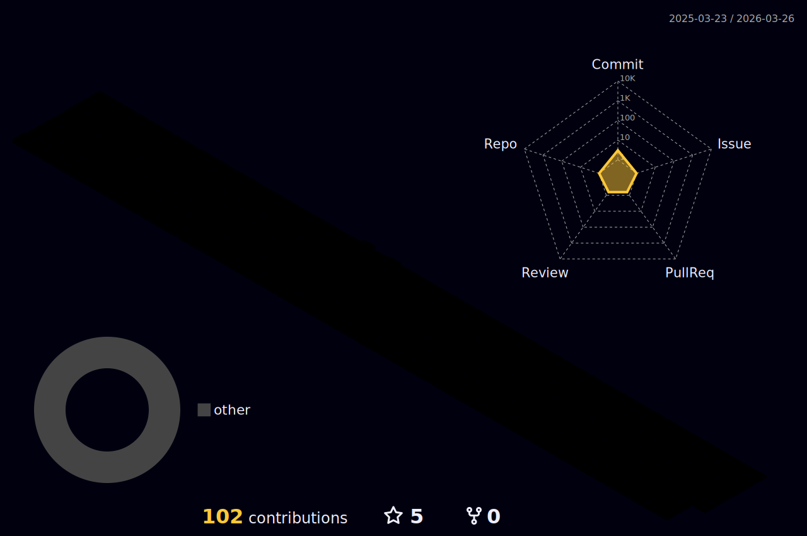

## Hola, me llamo Felipe y soy un programador

  <a href="https://github.com/fespinozasanchez/" target="_blank" >
  
  

 
  
  
  
  
  
  
    
  

  ### 📋 Languages
  
  
   
   
  
  
   
  
 ### 📚 Frameworks, Platforms and Libraries
   
  
   
  
  
   
  
  
### 💾 Databases
    
  
   
  
  
 
  ### 💻 IDES
  &nbsp;
&nbsp;
&nbsp;

  

### REDES

 
  
  
  
   
 
  
 

